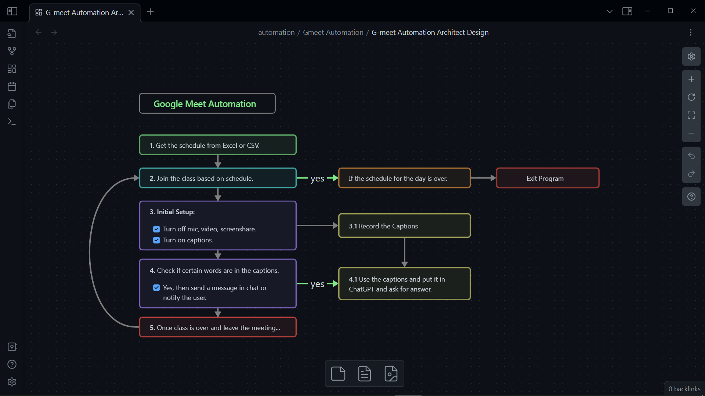

# Google Meet Automation

An automation software which automatically attends your online classes and will notify you whenever mam/sir calls you and saves the captions so that you can answer what she/he asked.

### 🎯 Features

- [ ] It should join/leave the meeting automatically (runs continuously from 9am to 4pm).
- [ ] It should notify you, whenever your name is called.
- [ ] It should save the captions of what sir/mam said last.
- [ ] Integration with ChatGPT so that answer is ready for the question.
- [ ] It should use less network by turning off the video and reducing the quality.
- [ ] It should take a screenshot of the presentation on every time interval.

### 🚀 How to run

1. Clone the repository
2. Install the dependencies (`mvn install`)
3. Add the following properties in `src/test/resources/config.properties`:
   ```properties
   EXECUTABLE_PATH=C:\\Program Files\\Google\\Chrome\\Application\\chrome.exe
   USER_DATA_DIR=C:\\Users\\<username>\\AppData\\Local\\Google\\Chrome\\User Data
   PROFILE_DIRECTORY=Profile 1
   ```
4. Change your schedule in `assets/schedule/schedule.xlsx`
5. Run the application (`mvn test`)

### 🏗️ Architect Design



### 📝 License

This project is licensed under the MIT License - see the [LICENSE](LICENSE) file for details.
